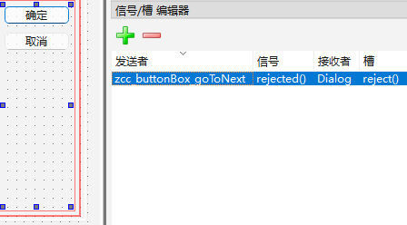

# Develop manual

[toc]

---

## Bug fixes

The MNE packages are not so solid.

```python
# Solve the problem of 'multitaper' psd function not recognizing 'names' keyword argument.

# File: Lib/site-packages/mne/time_frequency/spectrum.py
# Method: BaseSpectrum
# Lineno: 324
# Append the popping code:

# triage method and kwargs. partial() doesn't check validity of kwargs,
# so we do it manually to save compute time if any are invalid.
psd_funcs = dict(welch=psd_array_welch, multitaper=psd_array_multitaper)

# Solve the problem of MNE
if method == 'multitaper' and 'names' in method_kw:
    method_kw.pop('names')

_check_method_kwargs(psd_funcs[method], method_kw, msg=f'PSD method "{method}"')

```

## UI design

I use the `pyside6-designer.exe` for UI design.
The `*.ui` files are placed in the [layout](./layout) folder.

### How do I connect the layout with the operations

The main idea is setup the _objectName_ as the format of _zcc_objectType_objectOperation_.
And the _objectType_objectOperation_ part is set on the class to bind it.
See the [base_window.py](./python/qt/base_protocol_window.py), `BaseWindow` class for details.

- The class's attributes are kept as `None` if the UI does not support it;
- The `warning` arises when the UI has some object but the class does not handle it.

```python
def _assign_children(self):
    for k, v in self.children.items():
        attr = k[len(self.known_component_prefix):]

        if not hasattr(self, attr):
            logger.warning(
                f'Unknown attribute (UI has it, but window does not.): {attr}')

        self.__setattr__(attr, v)

        logger.debug(f'Assigned child: {attr} = {v}')
```

### Main window

The main entrance of the application is the [data_selection.ui](./layout/data_selection.ui)

#### How does it open the protocols UI?

I unbind the `accepted()` signal of the buttonBox slots,
and reassign it with protocol UI starter.
Since the `rejected()` signal is kept, it closes the window immediately.



```python

'''
File: python/qt/window_of_data_selection.py
Class: DataSelectionWindow
'''

def handle_goToNext_events(self):

    def _accept():
        unknown_protocol = True

        if self.protocol == 'MI':
            window = MIWindow(self.chosen_files, self.window)
            window.show()
            unknown_protocol = False

        if unknown_protocol:
            logger.warning('Not support protocol: {self.protocol}')

    self.buttonBox_goToNext.accepted.connect(_accept)
```

### The base of UI

The base layout of setup options UI is the [setup_options.ui](./layout/setup_options.ui),
which is handled by the `SetupOptionsWindow` class.
The `window.show()` method shows it.

## Appendix
