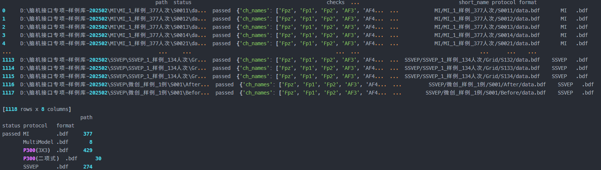
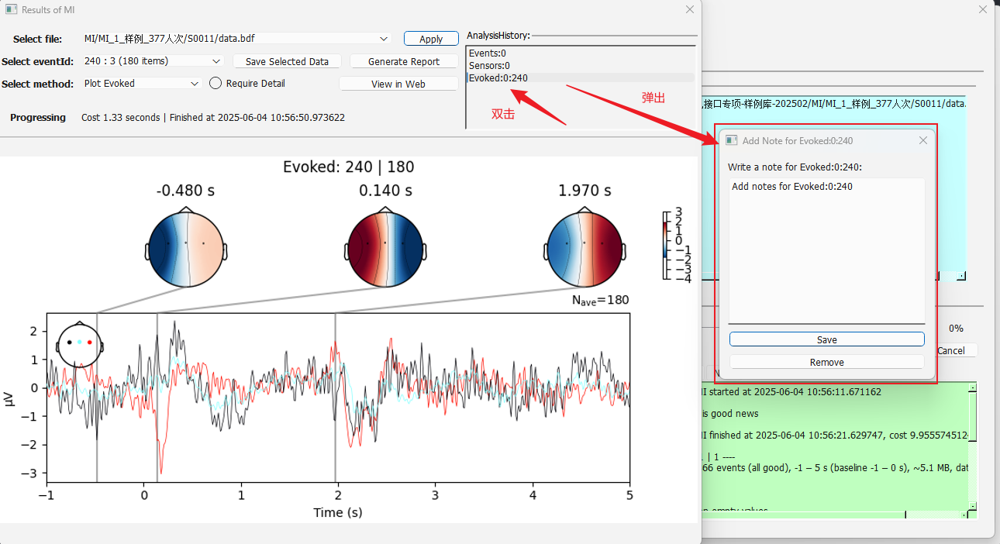

# 使用说明

---

[toc]

## Python 环境的安装

建议使用 `miniconda` 作为环境管理器
<https://www.anaconda.com/docs/getting-started/miniconda/main>

若使用 `PyCharm` 等软件也不妨碍本软件的使用，但请根据实际情况调整 `venv` 的配置方式。

建议使用软件自带的 `requirements.txt` 安装 `Python` 环境，开发机的版本是 `3.12.7`。

```shell
# Create and install the venv
conda create -n eeg-for-everyone python=3.12.7
pip install -r requirements.txt

# Activate the venv
conda activate eeg-for-everyone
```

软件自带的环境仅安装基本的 `torch`。如需调用 GPU，请在环境配置完成之后，访问其官网按要求安装。
<https://pytorch.org/get-started/locally/>

## 数据源设置

使用软件的第一步需要进行目录设置，设置文件为 `config.yaml`，请根据实际情况为每个目录命名。
软件会自动检索指定目录内的全部文件。

```yaml
DataFolders:
  Dir1: D://脑机接口专项-样例库-202502
  Dir2: (其他目录的占位符)
```

- 注意1：目录写法应与操作系统一致，比如 `Windows` 系统就应该遵循 `D://a//b` 的写法。
- 注意2：如果目录不存在或不合法，那么软件会自动忽略它。

## 文件检索与检查（首次运行或数据改变时运行）

运行 `new-files-arrived.ps1` 脚本完成文件检索，并检查脑电数据是否合规。
请打开 `Windows` 自带的 `Powershell` 工具运行该脚本。

```shell
./new-files-arrived.ps1
```

这一过程是自动的，但运行时间较长，运行时间由目录中的脑电数据数量确定。
检索结果会保存在 `cache` 目录下。如果首次运行或数据有所改变时需要运行该脚本。

当看到类似下图的输出信息时，说明该脚本执行完毕。



## 软件启动

运行 `start-app.ps1` 即可启动软件，软件启动时会自动打开 `UI` 操作界面。

- 注意该脚本内含启动 `venv` 的内容，请根据实际情况修改它。

```shell
./start-app.ps1
```

## 分析结果追溯

由于脑电数据可能面临分析时间较长的问题，因此软件增加了分析结果追溯功能，操作过程如下图所示。



通过鼠标左键单击对应项，可以立即呼出既往分析结果。
通过鼠标左键双击对应项，可以对其进行 `legend` 修改或移除操作。
这些结果会反映在生成的 `pdf` 报告里。

## 可能导致软件启动失败的已知问题

1. 模块版本冲突：
   由于 `Python` 以开源包为主，因此软件更新时可能产生不兼容的情况。
   解决方案：锁定开源包的适用版本。

2. 本地端口冲突：
   软件需要利用本地端口进行细节展示，如果端口占用会导致软件启动失败。
   解决方案：修改 `config.yaml` 文件中的 `Dash.port` 项，选择可用端口。
